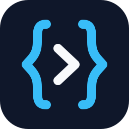

# openpredicate.tech

The public website for the [**OpenPredicate**](https://github.com/OpenPredicate/open-predicate)
specification — an open standard for JSON-encoded predicates.

The site's job is to make the standard discoverable and understandable: say what it is in one
sentence, show it working before asking anyone to read anything, teach the two rules that surprise
people, and then get out of the way of the normative text.

It also does one thing a README cannot. **It serves the schema at its own `$id`**, so
`https://openpredicate.tech/schema/v0.4.0/open-predicate-schema.json` resolves to the file it
identifies, and the `$ref` workflow the spec describes actually works. The RFC 9457 problem-type
URIs resolve too, one page each.

## What is here

| Path | What it is |
| --- | --- |
| `/` | The landing page: what it is, why, the two rules, and the integration points. |
| `/spec/` | The specification, rendered from the vendored `SPEC.md` with a sticky contents sidebar. |
| `/operators/` | Every operator, grouped by profile — **generated from the schema at build time**. |
| `/playground/` | Write a filter, validate it against the real grammar in the browser. |
| `/problems/` | The five error conditions, one dereferenceable page each. |
| `/schema/` | Every published grammar version and its immutable URL. |
| `/changelog/` | The changelog, rendered from the vendored `CHANGELOG.md`. |

## Running it

```bash
npm install
npm start          # build, then serve on http://localhost:4173
npm run build      # render into dist/
npm test           # build, then check the built site
```

Node 22 or newer. `npm test` asserts that every page and asset exists, that no internal link is
dead, that no template expression leaked into the output, that the operator reference covers every
operator in `x-profiles`, and that the playground's validator really accepts and rejects the right
filters.

## How it is built

Plain static HTML, rendered by [`build.mjs`](./build.mjs). No framework, no client-side routing, no
CSS pipeline — a specification site should be readable with JavaScript off, cacheable, and still
legible in ten years. The only script that ships is the playground's.

| File | Role |
| --- | --- |
| [`build.mjs`](./build.mjs) | Renders every page into `dist/`. Fails the build rather than publishing something misleading. |
| [`lib/layout.mjs`](./lib/layout.mjs) | The page shell, and the single source of the site's constants — version, URLs, contact. |
| [`lib/markdown.mjs`](./lib/markdown.mjs) | Renders the vendored spec documents, with GitHub-compatible heading anchors. |
| [`lib/operators.mjs`](./lib/operators.mjs) | Builds the operator reference out of the schema. Throws if an operator in `x-profiles` has no definition. |
| [`lib/validator.mjs`](./lib/validator.mjs) | Compiles the schema into a dependency-free browser validator, and self-checks it. |
| [`lib/highlight.mjs`](./lib/highlight.mjs) | Build-time syntax highlighting for JSON, YAML and HTTP. |
| [`lib/home.mjs`](./lib/home.mjs), [`lib/problems.mjs`](./lib/problems.mjs) | Page content. |

### The site cannot drift from the standard

Three deliberate constraints, because a specification site that contradicts its own specification is
worse than no site:

- **The spec page is the spec.** `/spec/` renders the vendored `SPEC.md` — the normative file — not
  a summary of it.
- **The operator reference is generated.** Descriptions, operand shapes and examples are read out of
  `open-predicate-schema.json` at build time. Nothing is retyped.
- **The playground uses the real grammar.** [`lib/validator.mjs`](./lib/validator.mjs) compiles the
  served schema into a standalone ES module with [Ajv](https://ajv.js.org), bundles it, and runs a
  dozen known-good and known-bad filters through it before the build is allowed to finish. There is
  no third-party script and no runtime CDN.

The build also refuses to publish a schema whose `$id` is not the URL this site serves it at — a
schema published at any other address is a broken pin.

### Tests

```bash
npm test            # build, then check the built site
npm run test:layout # build, then measure it in a real browser
npm run test:all    # both
```

[`test.mjs`](./test.mjs) checks the output: every page and asset exists, links resolve, the schema
sits at its own `$id`, the playground really rejects a malformed filter.

[`test-layout.mjs`](./test-layout.mjs) checks what only a browser can see — horizontal overflow,
computed contrast, target sizes, heading outline — across four viewport widths and both colour
schemes. Each of its assertions stands for a bug that reached production once: a bare `1fr` grid
track letting a wide `<pre>` stretch the page past the viewport, a `minmax(380px, …)` that could not
fit a 342px container, a copy button left `opacity: 0` until `:hover` on devices that never hover,
and four colour pairs under 4.5:1. All four were confirmed to fail the suite when reintroduced.

It drives Chrome over the DevTools Protocol through [`lib/browser.mjs`](./lib/browser.mjs) — about
sixty lines, no driver dependency. Chrome's `--window-size` silently clamps to 500px, so the
viewport is set through `Emulation` instead; a screenshot taken at `--window-size=390` is not a
390px render, and trusting one is how the overflow bug survived a visual check. Set `CHROME_PATH` to
pick a binary. With no browser present the suite fails rather than skipping.

### Tracking the specification

The normative documents live in the [specification
repository](https://github.com/OpenPredicate/open-predicate) and are vendored here under
`content/`. Keeping up with a release has three parts, so that no step depends on someone
remembering it.

**It is noticed.** [`.github/workflows/sync-spec.yml`](./.github/workflows/sync-spec.yml) checks the
upstream releases once a day. When the latest tag is not the one the site records, it syncs, builds,
tests, and opens a pull request with the diff. Merging is a human's call, and the workflow can be
run on demand from the Actions tab against any tag or branch.

**It is one command.** Nothing about the version is typed:

```bash
npm run sync            # from main
npm run sync -- v0.6.0  # from a tag
npm test                # then check the diff
```

`sync.mjs` reads the grammar version out of the schema's own `$id` and writes the file to the path
that `$id` names, so a release that moves the grammar *adds* `static/schema/vX.Y.Z/` instead of
overwriting a published one — those URLs are immutable, and `/schema/` grows a row for the new
version on its own. The release version comes from the tag, or from the changelog when syncing an
untagged branch. Both land in `content/spec-version.json`, which is what
[`lib/layout.mjs`](./lib/layout.mjs) reads; it is generated, so don't edit it by hand.

**It cannot drift quietly.** `npm test` fails if the version the site displays disagrees with the
vendored artefacts — including against `CHANGELOG.md`, which is fetched separately from the schema
and so is real evidence that both came from the same ref. A half-finished sync is a test failure
rather than a site that claims to document a release it never pulled in.

Syncing is a separate step from the build on purpose: a build never touches the network, so it is
reproducible and cannot be broken by a push upstream.

[`ci.yml`](./.github/workflows/ci.yml) runs both suites on every pull request and every push to
`main`. The sync workflow also runs them itself, so that a sync whose tests fail still opens a pull
request with the result stated — that is the case a human most needs to see the diff for.

## Deploying

Netlify, configured by [`netlify.toml`](./netlify.toml): `npm run build`, publish `dist/`. Pushes to
`main` deploy; pull requests get a preview, marked `noindex` so a preview cannot outrank the site.
The custom domain and its certificate are set in Netlify, not in the repository.

Two things the build hands the host:

- **`dist/_headers`**, generated per published schema version. It sets the media type a `$ref`
  consumer expects (`application/schema+json`), CORS — the schema is fetched cross-origin by
  tooling and by this site's own playground — and a one-year immutable cache, which is only safe
  because a published `$id` never changes.
- **Clean URLs and `404.html`**, which are Netlify defaults rather than configuration.
  [`serve.mjs`](./serve.mjs) imitates both, so `npm start` shows what will actually be published.

## License

[MIT](./LICENSE), the same as the specification. The logo and wordmark are in
[`static/assets/`](./static/assets).
